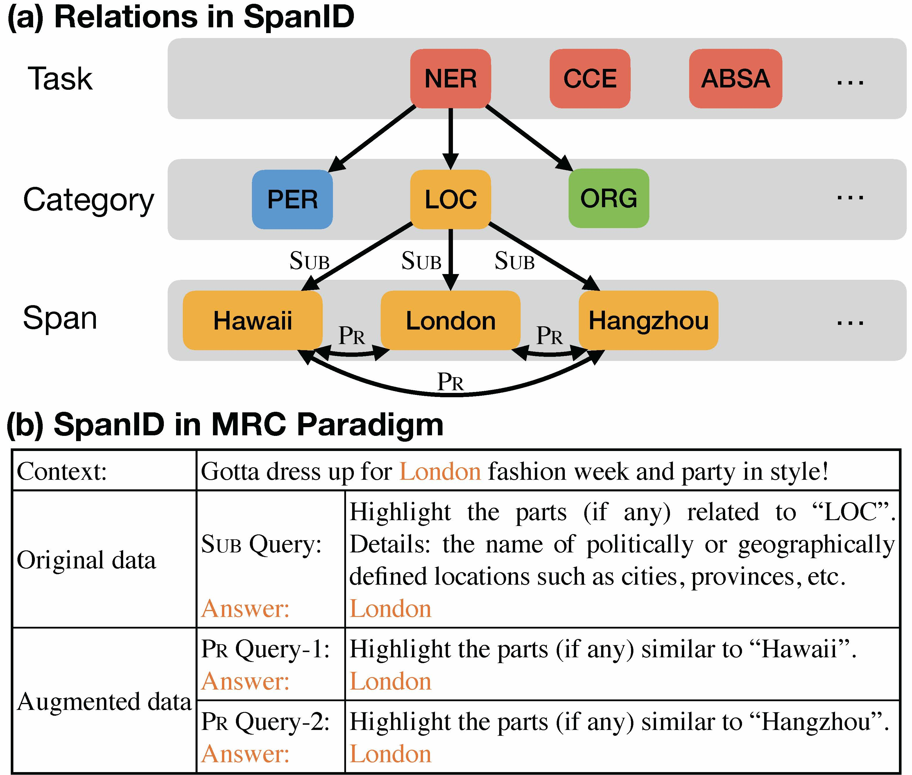

# PeerDA: Data Augmentation via Modeling Peer Relation
This repository contains the implementation of our paper "PeerDA: Data Augmentation via Modeling Peer Relation for Span Identification Tasks" (_ACL 2023_).
<p align="center">
    
</p>

## Requirements
* python==3.7.3
* pytorch==1.2.0 (also tested on pytorch 1.3.0)
* transformers4.1.1
* numpy==1.16.4
* tensorboardX==1.9
* tqdm==4.32.1


## Model
* roberta-base/large for NER, CCE, and SBPD
* bert-large-uncased for ABSA


## Dataset
* Please refer to ```./$task/Data/$dataset``` (e.g. ```./NER/Data/wnut```) for the data files of each task.
* For large datasets like OntoNotes5 and News20 SBPD, please download from official websites :point_right: [[OntoNotes5](https://drive.google.com/file/d/1OR3bDcPYIOru4EbP8WArDwSWbMJIZSSg/view?usp=sharing)][[News20 SBPD](https://drive.google.com/file/d/1Em1zGrgU-ywSVIXPUUcrl_5t931pfZDw/view?usp=sharing)].
* For CCE data 
  1. Download the data directly from [CUAD](https://github.com/TheAtticusProject/cuad)
  2. Rename the train/test splits and Place the files in ``CCE/Data/*``
     ```
     mv train_separate_questions.json CCE/Data/mrc-cce.test
     mv test.json CCE/Data/mrc-cce.test
     ```


## Quick Start -- WNUT as an example

* Reproduce the results on `WNUT17` (NER) dataset with RoBERTa-base:
  1. place data files in the directory `./NER/Data/wnut` (we have already put the `WNUT17` data in this directory. But for other large datasets, please download from our provided and put them in the corresponding data folder).
  2. Enter the task folder
      ```
      cd NER
      ```
  3. Train the WNUT model:
      ```
      python NER/train-NER.py \
        --output_dir ./saved_models/DA-roberta-base-wnut-1e-5 \
        --model_type roberta \
        --model_name_or_path roberta-base --cache_dir ../cache \
        --data_path ./Data/wnut \
        --do_train --do_eval --do_lower_case \
        --learning_rate 1e-5 \
        --num_train_epochs 30 \
        --per_gpu_eval_batch_size=64  \
        --per_gpu_train_batch_size=32 \
        --max_seq_length 160 --max_query_length 32\
        --save_steps 0 --logging_steps 1000\
        --fp16 --expand_rate 1 --gradient_accumulation_steps 1\
        --overwrite_output_dir --evaluate_during_training --DA # --sizeonly
      ```
     where ``--DA`` enables PeerDA variants:
     * PeerDA-Both: Please use the defaulted code.
     * PeerDA-Categ: Please use ``--expand_rate 0``.
     * PeerDA-Size: Please use ``--expand_rate 1`` and enable ``--sizeonly``.
## Training 
  
  1. place data files in the directory ```./$task/Data/$dataset``` if not done yet.
  2. Train the model with the following scripts (Note that there is a data caching process (only once) for CCE tasks to split the contracts into training examples, which takes some time before training the model):
      ```
      cd $task
      bash $script
      ```
 ## Usage
 TODO

## Citation
If the code is used in your research, please star our repo and cite our paper as follows:
```
@inproceedings{xu2022peerda,
    title = "PeerDA: Data Augmentation via Modeling Peer Relation for Span Identification Tasks",
    author = "Xu, Weiwen  and
      Li, Xin  and
      Deng, Yang  and
      Lam, Wai  and
      Bing, Lidong",
    booktitle = "The 61th Annual Meeting of the Association for Computational Linguistics.",
    year = "2023",
}
```
     
